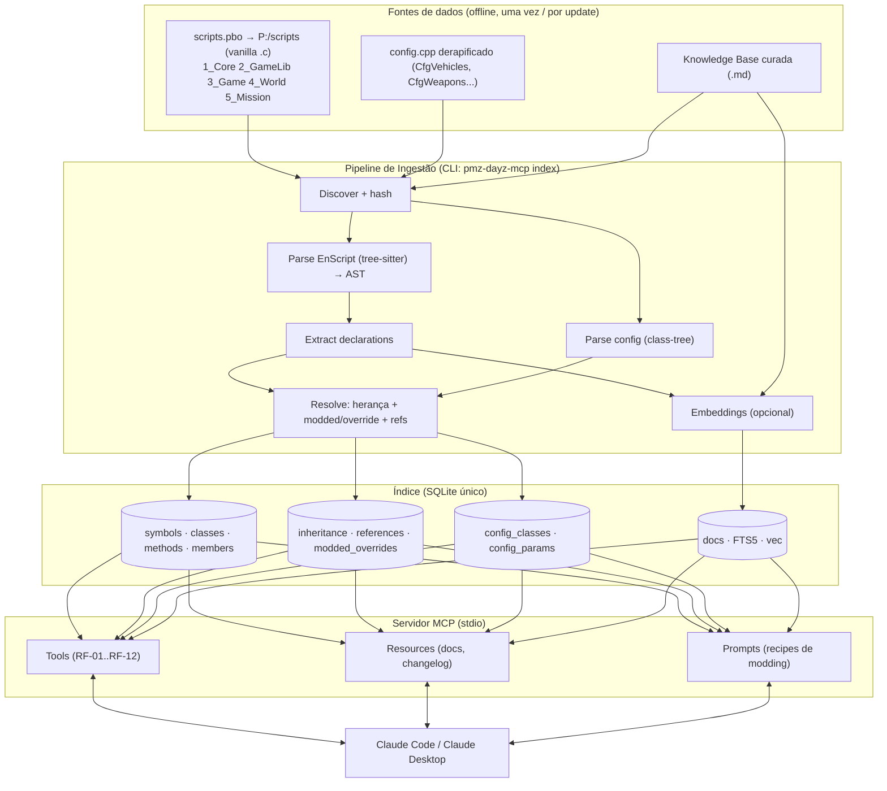

# PMZ_DAYZ_MCP_PLAN.md
### Planejamento de Engenharia — Servidor MCP "PMZ DayZ Knowledge Server"

> **Objetivo do documento:** especificação técnica completa e acionável para o **Claude Code** construir, do zero, um servidor MCP profissional que dê ao Claude conhecimento **factual e estruturado** do DayZ 1.29 (e 1.28 para diff) — API de script, hierarquia de configs, hooks de modding e contexto conceitual — para desenvolver mods **por mecanismo, nunca por achismo**.
>
> **Autor/Marca:** PandoraModz (PMZ) · pandoramodz.com.br
> **Versão do plano:** 1.0 · **Engine alvo:** Enfusion (DayZ Standalone 1.29) · **Runtime do MCP:** Node.js 20+ / TypeScript
> **Formato:** handoff para Claude Code (execução por fases).

---

## 0. Diagnóstico: por que a tentativa anterior não ficou funcional

A versão anterior indexou ~2.501 classes (1.28) / ~2.495 (1.29), mas não virou uma ferramenta confiável. As causas típicas — e que este plano corrige de forma explícita:

| Sintoma provável | Causa raiz | Correção neste plano |
|---|---|---|
| Símbolos faltando / assinaturas erradas | Parser por **regex/heurística** quebra com EnScript real (`ref`, `autoptr`, `proto native`, generics `array<ref X>`, precedência de `&`) | **Parsing por AST** com `tree-sitter-enforce` + extrator de declarações (§4, §6) |
| "Achei a classe mas não sei os métodos herdados" | Índice sem **resolução de herança** e sem `modded class` | Grafo de herança + merge de `modded`/`override` na ingestão (§5, §6) |
| Retorno gigante estourando contexto | Tool devolvia arquivo inteiro | Tools **cirúrgicas** (assinatura, trecho por range, referências paginadas) (§7) |
| "Conhece a API mas não sabe COMO usar" | Só índice de código, **sem camada conceitual** | **Knowledge base curada** (persistência, RPC, actions, LODs...) indexada e consultável (§4.4, §7) |
| Índice desatualizava a cada update do jogo | Reindex manual e total | Pipeline **incremental** por hash de arquivo (§6.4) |

**Princípio-guia:** o MCP não "adivinha". Toda resposta do Claude sobre DayZ deve poder ser rastreada a `arquivo:linha` do vanilla ou a um doc curado versionado.

---

## 0.5. Ponto de partida obrigatório: **auditar e adaptar o MCP atual** (NÃO recomeçar do zero)

> **Instrução direta ao Claude Code:** já existe um MCP de DayZ construído pelo Kelly (Node.js, com ~2.501 classes indexadas em 1.28 / ~2.495 em 1.29). **Antes de escrever qualquer código novo**, você deve *inventariar o MCP existente*, medir onde ele falha com evidência (não com achismo) e decidir, componente por componente, o que **reaproveitar / adaptar / substituir**. O objetivo é **evoluir** o que já existe — inclusive preservando o trabalho de indexação já feito — e migrar o armazenamento para **SQLite**.

### 0.5.1 Passos da auditoria (Fase -1, entregável obrigatório)
1. **Localizar e mapear** o repositório do MCP atual. Documentar: linguagem/runtime, dependências, **como parseia** os `.c` (regex/heurística × AST?), **como armazena** o índice (JSON em disco? memória? algum DB?), quais **tools** expõe e seus schemas, e como roda a indexação das ~2.495 classes.
2. **Rodar e testar** o MCP atual com casos-chave e registrar o resultado real:
   - `get class PlayerBase` → retorna a cadeia de herança completa até `EntityAI`? Métodos/membros com `arquivo:linha` corretos?
   - Uma classe com `modded class` → aparece o override?
   - Uma assinatura com generics (`ref array<...>`) → vem correta ou truncada?
   - Config `CfgVehicles::AKM` com herança resolvida → existe?
   → Isso vira a **linha de base de evidência** (o que já funciona × o que quebra).
3. **Relatório de gap** (`AUDIT_MCP_ATUAL.md`): tabela componente × estado atual × o que o plano pede × decisão (**manter / adaptar / substituir**) × justificativa.

### 0.5.2 Critérios de decisão por componente
| Componente atual | Se estiver assim… | Decisão |
|---|---|---|
| **Parser** | regex/heurística | **Substituir** por AST (`tree-sitter-enforce`) — ADR-03. É a causa nº 1 do "não funcional". |
| **Parser** | já usa AST/tree-sitter | **Adaptar** (reusar; só ajustar o extractor ao schema §5). |
| **Storage** | JSON/arquivo/memória | **Migrar para SQLite** — ADR-05 (ver §0.5.3). |
| **Storage** | já é um DB relacional | Avaliar migrar para SQLite por portabilidade; adaptar o schema. |
| **Tools** | interface já útil e usada pelo Kelly | **Manter os nomes/contratos** que já funcionam; trocar só o *backend* por baixo. Evita reaprender o fluxo. |
| **Indexação** | funciona e cobre 2.495 classes | **Reaproveitar como bootstrap** (ver §0.5.3) e depois reindexar por AST para corrigir precisão. |

### 0.5.3 Migração para SQLite (por que é interessante para este MCP)
Se o MCP atual guarda o índice em **JSON/arquivo/memória**, migrar para **SQLite** resolve limitações estruturais que provavelmente contribuíram para ele "não ficar funcional":
- **Consulta O(1)/indexada** em vez de varrer JSON em memória → herança, referências e busca de símbolo ficam < 50 ms (RNF-02).
- **Grafo relacional** (herança, `modded_overrides`, `refs`) que JSON plano não modela bem.
- **FTS5** para busca textual e **sqlite-vec** para semântica — no mesmo arquivo.
- **Portabilidade:** o `.db` viaja junto com o mod/projeto e é versionável (RNF-04).

**Plano de migração (preserva o trabalho já feito):**
1. Escrever um **importador único** (`ingest/migrate-legacy.ts`) que lê o índice atual (seja qual for o formato) e popula o schema §5 (`symbols`, `inheritance`, `config_classes`, ...). Isso dá um `.db` funcional **imediatamente**, com a precisão atual, rodando já nas tools novas.
2. Em seguida, rodar o **pipeline AST** (§6) sobre `P:\scripts` para **reindexar e corrigir** assinaturas/herança onde o parser antigo errava, sobrescrevendo os registros importados. A migração é o piso; a reindexação AST é o teto de qualidade.
3. Validar com os mesmos casos-chave da §0.5.1 — agora devem passar com `parse_quality='ok'`.

**Aceite da Fase -1:** `AUDIT_MCP_ATUAL.md` entregue + decisão por componente documentada + índice atual **migrado para SQLite** e respondendo às tools novas (ainda que com a precisão do parser antigo, a ser elevada nas fases seguintes).

---

## 1. Escopo

### 1.1 Requisitos funcionais (o que o MCP entrega ao Claude)
- **RF-01** Busca de símbolo (classe, método, membro, enum, função global, typedef) por nome exato/fuzzy.
- **RF-02** Definição completa de classe: pai, filhos, membros, métodos (com assinatura), origem `arquivo:linha`, e overrides de `modded class`.
- **RF-03** Cadeia de herança (ancestrais + descendentes) para qualquer classe.
- **RF-04** Assinatura + corpo (trecho) de um método específico, incluindo todas as sobrecargas e overrides.
- **RF-05** "Find references / callers" — onde um símbolo é usado/chamado (paginado).
- **RF-06** Leitura de fonte vanilla por `arquivo + range de linhas` (janela controlada).
- **RF-07** Resolução de **config**: `CfgVehicles::Class` com parâmetros **herdados resolvidos** (flatten da cadeia).
- **RF-08** Busca em configs (classe/parâmetro/valor).
- **RF-09** Catálogo de **hooks de modding** por classe (métodos overridáveis: `EEInit`, `OnStoreSave`, `OnRPC`, `SetActions`...).
- **RF-10** **Knowledge base conceitual** consultável (persistência, RPC, action system, inventory, LOD/P3D, RVMat, UI/layout, economia CE).
- **RF-11** Busca **semântica** (linguagem natural) sobre código + docs.
- **RF-12** **Diff de API** 1.28 → 1.29 (símbolos adicionados/removidos/alterados).

### 1.2 Requisitos não-funcionais
- **RNF-01 Precisão:** parsing por AST; zero invenção de assinaturas. Cobertura ≥ 98% das classes do corpus vanilla.
- **RNF-02 Latência:** consultas de símbolo/def < 50 ms; busca semântica < 400 ms (índice local).
- **RNF-03 Frugalidade de contexto:** payload padrão de cada tool ≤ ~1.5 KB; nunca despejar arquivo inteiro sem range.
- **RNF-04 Portabilidade:** índice em arquivo único SQLite, versionável/compartilhável, zero serviço externo obrigatório.
- **RNF-05 Incremental:** reindex de update do jogo processa só arquivos com hash alterado.
- **RNF-06 Segurança:** read-only, sem exec arbitrário, sanitização de paths (§12).
- **RNF-07 Determinismo:** mesma entrada → mesmo índice (builds reproduzíveis).

### 1.3 Fora de escopo (v1)
- Compilar/rodar EnScript. Escrever arquivos no projeto do usuário. Editar PBOs. (O MCP **lê e indexa**; quem escreve mod é o Claude Code no repositório do usuário.)

---

## 2. Decisões de arquitetura (ADRs)

Cada decisão segue o padrão da skill PMZ: **motivo · performance/memória · alternativas · risco**.

### ADR-01 — Runtime: Node.js 20+ / TypeScript
- **Motivo:** stack do Kelly (MCP anterior era Node), SDK MCP oficial é Tier-1 em TS, ecossistema de tree-sitter e sqlite maduro.
- **Perf/memória:** processo stdio leve; índice fora do heap (SQLite em disco + mmap).
- **Alternativas:** Rust (mais rápido, mas o LSP de referência já existe em Rust e reescrever atrasa; ganho marginal para carga read-mostly). Python (SDK ok, mas fora do fluxo do Kelly).
- **Risco:** baixo.

### ADR-02 — Protocolo: SDK MCP oficial (`@modelcontextprotocol/sdk`), transporte **stdio**, schemas **Zod v4**
- **Motivo:** integração nativa com Claude Code/Desktop; `McpServer.registerTool` + `registerResource`; validação automática de input via Zod.
- **Nota de spec:** *sampling* e *roots* estão **deprecados a partir da revisão 2026-07-28** — **não** dependemos de sampling; a camada semântica usa embeddings próprios chamando a API diretamente quando necessário. stdio permanece estável entre eras.
- **Alternativas:** Streamable HTTP (necessário só se virar serviço remoto multi-cliente — fora de escopo v1).
- **Risco:** baixo; fixar versão do SDK e revalidar em updates.

### ADR-03 — Parser EnScript: **AST via tree-sitter**, não regex
- **Motivo:** **esta é a correção central** do fracasso anterior. EnScript tem armadilhas que quebram regex (precedência `a & b == b` → `a & (b == b)`; `ref`/`autoptr`; `proto native`; `modded class`; generics aninhados `map<string, ref array<Object>>`). Já existe **`simonvic/tree-sitter-enforce`** (gramática pública) + **`devz-tools/enforce-script-lsp`** (lexer/parser/semantic em Rust) como referência de validação.
- **Estratégia:** usar `web-tree-sitter` (WASM) com a gramática Enforce. Para robustez, um **"declaration extractor"** roda sobre a AST e só extrai o que o índice precisa (headers de classe, assinaturas, membros, enums, typedefs) — **não** precisamos avaliar corpos de expressão, o que torna o parsing tolerante a construções exóticas.
- **Fallback:** se um arquivo falhar no tree-sitter, um extrator de nível de declaração (tokenizer + balanceamento de chaves) registra o símbolo como *parcial* com flag `parse_quality='degraded'`, garantindo cobertura sem inventar assinaturas.
- **Perf:** parsing incremental do tree-sitter; corpus completo (~milhares de `.c`) indexa em minutos, uma vez.
- **Risco:** gramática comunitária pode divergir de casos raros → mitigado por golden tests (§14) e flag de qualidade.

### ADR-04 — Parser de config: parser dedicado de **class-tree**
- **Motivo:** `config.cpp` (derapificado de `config.bin` via CfgConvert/DayZ Tools) tem gramática **própria e mais simples** que EnScript: `class Nome : Pai { param = valor; param[] = {...}; class Sub {...}; };`. Um parser recursivo dedicado resolve herança e arrays melhor que reaproveitar EnScript.
- **Resolução de herança:** ao consultar, faz **flatten** da cadeia (`CfgVehicles::Base → ... → Class`) aplicando override de parâmetros.
- **Risco:** includes/`#define`/macros de config → pré-processar com um passo de expansão de macros simples antes de parsear.

### ADR-05 — Storage: **SQLite** (com **FTS5**) + índice vetorial (**sqlite-vec**)
- **Motivo:** arquivo único portátil (RNF-04), relacional para grafo de herança/refs, **FTS5** para busca textual rápida, **sqlite-vec** para embeddings semânticos no mesmo arquivo. Zero infra (diferente do Postgres/Redis do PMZ_API, que é overkill para uma ferramenta local read-only).
- **Perf/memória:** `PRAGMA mmap_size`, `journal_mode=WAL`, índices em `name`/`parent`; consultas < 50 ms.
- **Alternativas:** Postgres/Redis (infra desnecessária para um índice local); LanceDB/Chroma (mais um serviço). SQLite ganha em simplicidade e distribuição do `.db` junto com o mod.
- **Risco:** vetores grandes → manter dimensão modesta (ex.: 768/1024) e semantic search opcional (o índice funciona 100% sem embeddings).

### ADR-06 — **Knowledge Base curada** como cidadão de primeira classe
- **Motivo:** requisito explícito do Kelly ("saber como funciona cada estrutura, contexto geral"). Índice de código sozinho não ensina *quando/como* usar. Docs curados (Markdown com front-matter) sobre subsistemas são indexados (FTS + embeddings) e expostos como **MCP Resources** + tool de busca.
- **Fontes:** BI Wiki (Enforce Script Syntax, CfgVehicles, Central Economy), DayZ Expansion "EnforceScript Pitfalls", dayzexplorer (Doxygen da API), e conhecimento sênior PMZ.
- **Risco:** manutenção → docs versionados no repo, com `game_version` e `last_verified`.

---

## 3. Visão de arquitetura



**Dois caminhos independentes:** *(a)* ingestão (pesada, offline, roda no setup e a cada patch); *(b)* runtime (leve, só lê SQLite e responde tools). O servidor nunca parseia em tempo de query.

---

## 4. Fontes de dados

### 4.1 Scripts vanilla (.c EnScript)
- **Obtenção:** DayZ Tools → extrair `scripts.pbo` → `P:\scripts` (padrão da comunidade). Módulos: `1_Core`, `2_GameLib`, `3_Game`, `4_World`, `5_Mission`.
- **O que indexar:** classes, `modded class`, `override`, membros, métodos (`proto`/`proto native`/`native`/script), enums, typedefs, `const` globais, funções globais, `#ifdef` (guardar branch condicional como metadado).

### 4.2 Configs derapificados (config.cpp)
- **Obtenção:** `CfgConvert -txt` (DayZ Tools) sobre os `config.bin` de `dayz`, `dayz_data`, etc.
- **Classes-alvo (mín.):** `CfgVehicles`, `CfgWeapons`, `CfgMagazines`, `CfgAmmo`, `CfgSlots`, `CfgPatches`, `CfgMods`, `CfgSpawnableTypes`, `cfgEconomyCore`, `CfgSurfaces`, `CfgSoundShaders`, `CfgSoundSets`, `CfgParticleSources`.

### 4.3 Diff de versões
- Indexar **1.28 e 1.29** em duas *snapshots* (coluna `game_version`) para alimentar RF-12 (o que mudou entre patches — crítico para migração de mods).

### 4.4 Knowledge Base curada (docs .md)
Cada doc: front-matter `{ id, title, tags, subsystem, game_version, last_verified, sources[] }`. Conjunto inicial obrigatório:

| id | Subsistema | Conteúdo mínimo |
|---|---|---|
| `kb-persistence` | Persistência | `OnStoreSave`/`OnStoreLoad`/`AfterStoreLoad`, `GetGame().SaveVersion()`, ordem de leitura, versionamento de save, pitfalls de corromper save |
| `kb-rpc` | Rede/RPC | `OnRPC`, `ScriptRPC`, `RPCSingleParam`/`RPC`, client→server trust, validação server-side, single/multiplayer, `PlayerIdentity` |
| `kb-actions` | Action System | `ActionBase`/`ActionContinuousBase`, `SetActions`/`AddAction`, condições (`ActionCondition`), `ActionTarget` |
| `kb-inventory` | Inventário | `InventoryLocation`, `EntityAI`, cargo/attachments, `PredictiveTakeToDst`, slots |
| `kb-lifecycle` | Ciclo de vida | `EEInit`, `EEDelete`, `EEItemLocationChanged`, `EEHealthLevelChanged`, `EEKilled`, `EEHitBy`, `Init()` vs construtor |
| `kb-config-hierarchy` | Config | herança em `CfgVehicles`, `scope`, `simulation`, `class DamageSystem`, spawnable types |
| `kb-economy-ce` | Central Economy | `types.xml`, `events.xml`, `cfgeconomycore.xml`, lifetime/restock, mapgrouppos |
| `kb-p3d-lod` | Modelagem P3D | LODs (Geometry, View Geometry, Roadway, Fire Geometry, Memory, Shadow Volume), named selections, mass, componentes |
| `kb-rvmat` | Materiais | rvmat/paa/edds, diffuse/normal/specular, diagnóstico (textura invisível, objeto preto/brilhando) |
| `kb-ui-layout` | UI | `.layout`/`.styles`, Widgets, `ScriptedWidgetEventHandler`, `ItemPreviewWidget`, virtualização/pooling |
| `kb-enforce-pitfalls` | Linguagem | `ref` vs `autoptr` (nunca ambos), não usar `delete`, precedência de operadores, managed vs unmanaged |
| `kb-modules-layers` | Arquitetura | quando usar `3_Game` vs `4_World` vs `5_Mission`; server vs client vs mission |

---

## 5. Modelo de dados (schema SQLite)

DDL de referência. `PRAGMA journal_mode=WAL; PRAGMA foreign_keys=ON;`

```sql
-- Arquivos-fonte indexados (para incremental por hash)
CREATE TABLE files (
  id            INTEGER PRIMARY KEY,
  path          TEXT NOT NULL,            -- ex: 4_World/Classes/ItemBase.c
  module        TEXT,                     -- 1_Core|2_GameLib|3_Game|4_World|5_Mission
  game_version  TEXT NOT NULL,            -- '1.29' | '1.28'
  sha1          TEXT NOT NULL,
  parse_quality TEXT DEFAULT 'ok',        -- ok | degraded | failed
  UNIQUE(path, game_version)
);

-- Símbolo unificado (classe, método, membro, enum, função, typedef, const)
CREATE TABLE symbols (
  id            INTEGER PRIMARY KEY,
  name          TEXT NOT NULL,
  kind          TEXT NOT NULL,            -- class|method|member|enum|enum_value|function|typedef|const
  file_id       INTEGER NOT NULL REFERENCES files(id),
  line_start    INTEGER NOT NULL,
  line_end      INTEGER,
  owner_id      INTEGER REFERENCES symbols(id),  -- classe dona (p/ métodos/membros)
  signature     TEXT,                     -- assinatura normalizada (métodos)
  return_type   TEXT,
  modifiers     TEXT,                     -- json: [static, proto, native, override, modded, private...]
  game_version  TEXT NOT NULL
);
CREATE INDEX idx_symbols_name ON symbols(name);
CREATE INDEX idx_symbols_owner ON symbols(owner_id);
CREATE INDEX idx_symbols_kind_ver ON symbols(kind, game_version);

-- Parâmetros de método (ordenados)
CREATE TABLE method_params (
  method_id  INTEGER NOT NULL REFERENCES symbols(id),
  ord        INTEGER NOT NULL,
  type       TEXT NOT NULL,               -- ex: 'ref array<Object>'
  name       TEXT,
  default_val TEXT,
  is_out     INTEGER DEFAULT 0,           -- out param
  PRIMARY KEY(method_id, ord)
);

-- Grafo de herança (child extends parent)
CREATE TABLE inheritance (
  child_id   INTEGER NOT NULL REFERENCES symbols(id),
  parent_name TEXT NOT NULL,              -- por nome (parent pode estar em outro arquivo/versão)
  game_version TEXT NOT NULL,
  PRIMARY KEY(child_id, game_version)
);
CREATE INDEX idx_inh_parent ON inheritance(parent_name, game_version);

-- modded class X → alvo modificado
CREATE TABLE modded_overrides (
  id          INTEGER PRIMARY KEY,
  target_name TEXT NOT NULL,              -- classe vanilla modificada
  symbol_id   INTEGER NOT NULL REFERENCES symbols(id),
  game_version TEXT NOT NULL
);

-- Referências / chamadas (find references)
CREATE TABLE refs (
  symbol_name TEXT NOT NULL,              -- símbolo referenciado
  file_id     INTEGER NOT NULL REFERENCES files(id),
  line        INTEGER NOT NULL,
  ref_kind    TEXT,                       -- call | type_use | extends | new
  game_version TEXT NOT NULL
);
CREATE INDEX idx_refs_name ON refs(symbol_name, game_version);

-- ===== CONFIG =====
CREATE TABLE config_classes (
  id           INTEGER PRIMARY KEY,
  root         TEXT NOT NULL,             -- CfgVehicles, CfgWeapons...
  name         TEXT NOT NULL,
  parent_name  TEXT,
  file_path    TEXT,
  line_start   INTEGER,
  game_version TEXT NOT NULL,
  UNIQUE(root, name, game_version)
);
CREATE INDEX idx_cfg_name ON config_classes(name, game_version);

CREATE TABLE config_params (
  class_id    INTEGER NOT NULL REFERENCES config_classes(id),
  key         TEXT NOT NULL,
  value       TEXT,                       -- escalar ou json-array
  is_array    INTEGER DEFAULT 0,
  PRIMARY KEY(class_id, key)
);

-- ===== KNOWLEDGE BASE =====
CREATE TABLE docs (
  id           INTEGER PRIMARY KEY,
  doc_id       TEXT UNIQUE NOT NULL,      -- kb-persistence...
  title        TEXT NOT NULL,
  subsystem    TEXT,
  tags         TEXT,                      -- json
  body         TEXT NOT NULL,            -- markdown
  game_version TEXT,
  last_verified TEXT
);

-- Busca textual (FTS5) sobre símbolos+docs
CREATE VIRTUAL TABLE fts_search USING fts5(
  name, kind, body, doc_id UNINDEXED, symbol_id UNINDEXED,
  tokenize = 'unicode61'
);

-- Busca vetorial (sqlite-vec) — opcional
CREATE VIRTUAL TABLE vec_chunks USING vec0(
  chunk_id INTEGER PRIMARY KEY,
  embedding FLOAT[768]
);
CREATE TABLE vec_meta (
  chunk_id INTEGER PRIMARY KEY,
  source_kind TEXT,   -- symbol | doc
  source_id   INTEGER,
  preview     TEXT
);
```

---

## 6. Pipeline de ingestão

CLI: `pmz-dayz-mcp index --scripts P:/scripts --config ./derap --docs ./kb --version 1.29 --db ./dayz-1.29.db`

### 6.1 Fase A — Discover + hash
Varre recursivamente `.c` e `config.cpp`; calcula `sha1`; compara com `files` existente. Só processa novos/alterados (incremental). Marca removidos.

### 6.2 Fase B — Parse EnScript (AST)
1. Carrega `web-tree-sitter` + `tree-sitter-enforce.wasm`.
2. Gera AST por arquivo.
3. **Declaration extractor** percorre nós de interesse: `class_declaration`, `modded` modifier, `method_declaration`, `field_declaration`, `enum_declaration`, `typedef`, `const`. Extrai nome, tipo, modifiers, params (com tipos genéricos preservados: `ref array<ref PlayerBase>`), `line_start/end`.
4. Coleta `refs` de nós `call_expression`, `new`, `type` e `extends`.
5. Falha de parse → fallback tokenizer + `parse_quality='degraded'` (símbolo entra parcial, nunca inventado).

### 6.3 Fase C — Parse config (class-tree)
Pré-processa macros (`#define`), parseia `class ... : ... { }` recursivamente, grava `config_classes` + `config_params` (arrays viram json).

### 6.4 Fase D — Resolve
- **Herança:** liga `inheritance.parent_name` → `symbols` (mesma versão); detecta ciclos.
- **modded/override:** associa `modded class X` ao alvo `X`; marca métodos `override`.
- **Refs:** normaliza nomes; descarta ruído (tipos primitivos).
- **FTS:** popula `fts_search`.

### 6.5 Fase E — Embeddings (opcional)
Chunk por símbolo (assinatura + doc-comment) e por seção de doc curado → embeddings → `vec_chunks`. **Desligável** (`--no-embeddings`); o índice funciona 100% sem isso (busca cai para FTS).

### 6.6 Reprodutibilidade
Ordenação estável, `sha1` por arquivo, versão do índice em tabela `meta(schema_version, tool_version, indexed_at)`.

---

## 7. Catálogo de Tools MCP

Convenção: todas retornam **JSON compacto**; toda referência a código traz `file:line` e `game_version`. `version` é opcional e default = versão configurada do servidor.

| Tool | Propósito | Input (Zod) | Saída (essência) |
|---|---|---|---|
| `dayz_search_symbol` | Busca símbolo (RF-01) | `{ query: string, kind?: enum, limit?: number(≤25), version?: string }` | lista `{name, kind, owner, file, line, signature}` |
| `dayz_get_class` | Classe completa (RF-02) | `{ name: string, include_inherited?: bool, version? }` | `{name, parent, children[], members[], methods[], modded_by[], file, line}` |
| `dayz_inheritance_chain` | Ancestrais + descendentes (RF-03) | `{ name, direction?: up\|down\|both, depth?: number, version? }` | árvore de nomes com `file:line` |
| `dayz_get_method` | Método + overloads/overrides (RF-04) | `{ class?: string, method: string, version? }` | `{signature, return_type, params[], overrides[], modded_by[], file, line}` |
| `dayz_get_source` | Trecho por range (RF-06) | `{ file: string, line_start: number, line_end: number, version? }` | texto do trecho (janela máx. 200 linhas) |
| `dayz_find_references` | Onde é usado (RF-05) | `{ name: string, ref_kind?: enum, page?: number, version? }` | páginas de `{file, line, ref_kind}` |
| `dayz_list_hooks` | Hooks overridáveis da classe (RF-09) | `{ class: string, version? }` | métodos overridáveis + doc curto (ex.: `OnStoreSave`, `EEInit`, `SetActions`) |
| `dayz_get_config_class` | Config resolvido (RF-07) | `{ root?: string, name: string, resolve_inheritance?: bool, version? }` | `{root, name, parent, params{}, inherited_from{}}` |
| `dayz_config_search` | Busca em config (RF-08) | `{ query: string, root?: string, by?: class\|param\|value, limit?, version? }` | matches `{root, class, key, value}` |
| `dayz_kb_search` | Knowledge base conceitual (RF-10) | `{ query: string, subsystem?: string, limit? }` | trechos de doc `{doc_id, title, excerpt}` |
| `dayz_semantic_search` | Busca NL código+docs (RF-11) | `{ query: string, scope?: code\|docs\|all, limit? }` | ranqueado `{source_kind, ref, preview, score}` |
| `dayz_api_diff` | Diff 1.28→1.29 (RF-12) | `{ from: string, to: string, name?: string, kind? }` | `{added[], removed[], changed[]}` |
| `dayz_index_status` | Meta/saúde do índice | `{}` | `{versions[], counts{classes,methods,configs,docs}, degraded_files, indexed_at}` |

### 7.1 Exemplos de uso (como o Claude vai chamar)

**"Como salvo dados persistentes num item?"**
1. `dayz_kb_search{query:"persistência item OnStoreSave"}` → doc `kb-persistence`.
2. `dayz_get_method{class:"ItemBase", method:"OnStoreSave"}` → assinatura exata + `ctx.Write` pattern.
3. `dayz_find_references{name:"OnStoreLoad", ref_kind:"call"}` → exemplos vanilla reais.
→ Claude escreve o override **com assinatura correta e ordem de leitura correta**, citando `file:line`.

**"Quero um item que herda de Edible_Base — o que ganho?"**
1. `dayz_inheritance_chain{name:"Edible_Base", direction:"up"}`.
2. `dayz_get_class{name:"Edible_Base", include_inherited:true}` → membros/métodos herdados.

**Regras de payload (RNF-03):** `dayz_get_class` retorna assinaturas, **não** corpos; corpo só via `dayz_get_source` com range. `find_references` sempre paginado (25/página).

---

## 8. Resources & Prompts MCP

### 8.1 Resources (read-only, `dayz://`)
- `dayz://docs/{doc_id}` — cada doc curado da KB (o Claude pode "abrir" `kb-rpc` inteiro).
- `dayz://changelog/1.28-1.29` — resumo de diff de API renderizado.
- `dayz://index/status` — snapshot do `dayz_index_status`.

### 8.2 Prompts (templates de modding PMZ)
Prompts reutilizáveis que já embutem o padrão PMZ (validação server-side, `pmz-` prefix quando for FiveM — aqui é DayZ, então convenções EnScript):
- `recipe_persistent_item` — esqueleto de item com persistência correta.
- `recipe_rpc_secure` — RPC client→server com validação e `PlayerIdentity`.
- `recipe_custom_action` — `ActionContinuousBase` + `SetActions`.
- `recipe_modded_class` — override seguro de classe vanilla (sem quebrar cadeia).

---

## 9. Estrutura de arquivos do projeto

```
pmz-dayz-mcp/
├─ package.json
├─ tsconfig.json
├─ README.md
├─ vendor/
│  └─ tree-sitter-enforce.wasm         # gramática Enforce (build do simonvic/tree-sitter-enforce)
├─ kb/                                  # Knowledge Base curada (.md com front-matter)
│  ├─ kb-persistence.md
│  ├─ kb-rpc.md
│  ├─ kb-actions.md
│  └─ ... (§4.4)
├─ src/
│  ├─ server.ts                         # McpServer, registerTool/Resource/Prompt, stdio
│  ├─ db/
│  │  ├─ schema.sql                     # §5
│  │  ├─ connection.ts                  # better-sqlite3 + PRAGMAs + sqlite-vec/FTS load
│  │  └─ queries.ts                     # queries preparadas (herança, refs, config flatten)
│  ├─ ingest/
│  │  ├─ cli.ts                         # `pmz-dayz-mcp index ...`
│  │  ├─ discover.ts                    # walk + sha1 + incremental
│  │  ├─ enscript/
│  │  │  ├─ parser.ts                   # web-tree-sitter loader
│  │  │  ├─ extractor.ts                # AST → declarações
│  │  │  └─ fallback.ts                 # tokenizer degradado
│  │  ├─ config/
│  │  │  ├─ preprocess.ts               # #define/macros
│  │  │  └─ classtree.ts                # parser de config.cpp
│  │  ├─ resolve.ts                     # herança + modded + refs + FTS
│  │  └─ embeddings.ts                  # chunk + embed (opcional)
│  ├─ tools/                            # 1 arquivo por tool (§7)
│  │  ├─ searchSymbol.ts
│  │  ├─ getClass.ts
│  │  ├─ inheritanceChain.ts
│  │  ├─ getMethod.ts
│  │  ├─ getSource.ts
│  │  ├─ findReferences.ts
│  │  ├─ listHooks.ts
│  │  ├─ getConfigClass.ts
│  │  ├─ configSearch.ts
│  │  ├─ kbSearch.ts
│  │  ├─ semanticSearch.ts
│  │  ├─ apiDiff.ts
│  │  └─ indexStatus.ts
│  ├─ resources/registerResources.ts
│  ├─ prompts/registerPrompts.ts
│  └─ util/{paths.ts,logger.ts,pagination.ts}
├─ test/
│  ├─ golden/enscript/                  # arquivos .c + AST esperada (§14)
│  ├─ golden/config/
│  ├─ parser.spec.ts
│  ├─ resolve.spec.ts
│  └─ tools.contract.spec.ts
└─ data/                                # índices gerados (gitignored ou versionados)
   ├─ dayz-1.29.db
   └─ dayz-1.28.db
```

### 9.1 Dependências (bootstrap)
```
npm i @modelcontextprotocol/sdk zod better-sqlite3 web-tree-sitter sqlite-vec
npm i -D typescript tsx vitest @types/node
```
- `better-sqlite3` (síncrono, rápido, ideal para read-mostly local).
- `sqlite-vec` (extensão vetorial) — carregada em runtime; opcional.
- `web-tree-sitter` + `tree-sitter-enforce.wasm`.

---

## 10. Fluxo de execução (runtime)

1. Claude Code inicia o processo via stdio (config §15).
2. `server.ts` abre o SQLite (WAL, mmap, carrega sqlite-vec/FTS), registra tools/resources/prompts, conecta `StdioServerTransport`.
3. Claude chama, ex., `dayz_get_method` → Zod valida input → query preparada em `queries.ts` → retorno JSON compacto.
4. **Nenhum parsing em runtime.** Tudo já está no índice.
5. Erros de request → `McpError` (parâmetro inválido, símbolo inexistente com sugestões fuzzy).

**Latências-alvo:** símbolo/def/config < 50 ms; FTS < 100 ms; semantic < 400 ms.

---

## 11. Performance & escalabilidade
- **Índice:** WAL + `mmap_size` (ex. 256 MB) + índices em `name`/`owner_id`/`parent_name`.
- **Payloads:** teto por tool (RNF-03); paginação obrigatória em refs.
- **Startup:** abrir DB é O(1); sem carregar corpus em memória.
- **Embeddings:** dimensão modesta (768) e chunking por símbolo para caber muitos no `vec0` sem inchar o `.db`.
- **Escala futura:** se virar serviço remoto, trocar stdio por Streamable HTTP mantendo a mesma camada de tools (separação limpa em `tools/`).

---

## 12. Segurança
- **Read-only:** servidor nunca escreve fora do `.db` (e mesmo esse é escrito só pela CLI de index, não pelo servidor).
- **Path sanitization:** `dayz_get_source` só aceita paths **dentro do índice** (resolve contra `files.path`; rejeita `..`/absolutos externos). Sem acesso a disco arbitrário.
- **Input não confiável:** todo input vem do LLM → Zod estrito (`additionalProperties:false`), limites em `limit`/range.
- **Sem exec:** nenhuma tool executa comando/arquivo. Nenhuma tool aceita SQL cru (só queries preparadas).
- **Sem segredos:** o `.db` não guarda credenciais; embeddings, se usarem API, leem chave de env, nunca logada.

---

## 13. Roadmap por fases (com critérios de aceite)

### Fase -1 — Auditoria e migração do MCP atual (§0.5) — **primeira coisa a fazer**
Inventariar o MCP existente, medir falhas com evidência, decidir reuse/adapt/rebuild por componente e **migrar o índice atual para SQLite** (importador legacy).
**Aceite:** `AUDIT_MCP_ATUAL.md` + decisões documentadas + `.db` SQLite migrado respondendo às tools novas. (Ver §0.5.3.)

### Fase 0 — Bootstrap (0.5 dia)
Scaffold TS, `server.ts` com uma tool `dayz_index_status` mockada, conecta no Claude Code.
**Aceite:** Claude lista e chama a tool via stdio.

### Fase 1 — MVP de índice EnScript (núcleo)
CLI `index` → discover + tree-sitter + extractor + schema + `symbols/inheritance`. Tools `dayz_search_symbol`, `dayz_get_class`, `dayz_inheritance_chain`, `dayz_get_method`, `dayz_get_source`.
**Aceite:** indexa `P:\scripts` 1.29; `dayz_get_class{name:"PlayerBase"}` retorna pai `SurvivorBase`/cadeia até `EntityAI`, membros e métodos com `file:line` corretos; ≥ 98% das classes com `parse_quality='ok'`.

### Fase 2 — modded/override + references
Fase D completa; `dayz_find_references`, `dayz_list_hooks`.
**Aceite:** `dayz_list_hooks{class:"ItemBase"}` traz `OnStoreSave/OnStoreLoad/EEInit/SetActions`; `find_references{name:"OnRPC"}` pagina resultados reais do vanilla.

### Fase 3 — Config
Parser class-tree + `dayz_get_config_class` (com flatten de herança) + `dayz_config_search`.
**Aceite:** `dayz_get_config_class{name:"AKM", resolve_inheritance:true}` mostra params herdados de `Rifle_Base`/`Weapon_Base` com origem.

### Fase 4 — Knowledge Base + Resources/Prompts
Escrever os 12 docs (§4.4), indexar em FTS, `dayz_kb_search`, resources `dayz://docs/*`, prompts recipes.
**Aceite:** `dayz_kb_search{query:"ref vs autoptr"}` retorna `kb-enforce-pitfalls` com a regra correta.

### Fase 5 — Diff de versões + Semântica
Indexar 1.28; `dayz_api_diff`; embeddings + `dayz_semantic_search`.
**Aceite:** `dayz_api_diff{from:"1.28", to:"1.29"}` lista símbolos alterados; `semantic_search{query:"como fazer um item apodrecer com o tempo"}` retorna agentes/`Edible_Base`/CE lifetime relevantes.

### Fase 6 — Hardening
Golden tests (§14), incremental por hash validado, limites de payload, `McpError` com sugestões fuzzy, docs de operação.
**Aceite:** reindex de um patch simulado processa só arquivos alterados; suíte verde.

---

## 14. Testes & validação
- **Golden files (parser):** conjunto de `.c` cobrindo casos difíceis — `modded class`, `override`, `proto native`, generics aninhados, enums, `ref/autoptr`, precedência `a & b == b`. AST/extração esperada versionada; regressão detecta divergências.
- **Contrato de tools:** cada tool com teste de schema (input/output) e casos-limite (símbolo inexistente → sugestões; range fora do arquivo → erro claro).
- **Cobertura de corpus:** métrica de `parse_quality` por versão; meta ≥ 98% `ok`, lista de `degraded/failed` como issues.
- **Cross-check externo:** amostrar assinaturas contra `dayzexplorer` (Doxygen) e o `enforce-script-lsp` para validar.
- **Regressão de versão:** ao trocar 1.29→1.30 futuramente, os goldens acusam mudanças de gramática.

---

## 15. Integração com Claude Code / Claude Desktop

`mcp.json` (ou config equivalente do Claude Code):
```json
{
  "mcpServers": {
    "pmz-dayz": {
      "command": "node",
      "args": ["/caminho/pmz-dayz-mcp/dist/server.js"],
      "env": { "PMZ_DAYZ_DB": "/caminho/pmz-dayz-mcp/data/dayz-1.29.db" }
    }
  }
}
```
- Servidor lê `PMZ_DAYZ_DB` (default `data/dayz-1.29.db`); `--version` alterna snapshot.
- Recomendado: adicionar à **skill `dev-129-dayz`** uma instrução para o Claude **sempre** consultar `dayz_*` antes de afirmar assinatura/hierarquia (reforça "mecanismo, não achismo").

---

## 16. Riscos & mitigações

| Risco | Impacto | Mitigação |
|---|---|---|
| Gramática tree-sitter diverge de casos raros | Símbolos parciais | Fallback + `parse_quality` + golden tests; contribuir upstream se necessário |
| Update do jogo muda API | Índice desatualiza | Pipeline incremental por hash + snapshot por versão + `api_diff` |
| Macros/includes em config | Params faltando | Passo de pré-processamento de `#define` antes do parse |
| Spec MCP evoluir (2026-07-28) | Quebra de integração | stdio estável; fixar versão do SDK; não usar sampling/roots (deprecados) |
| `.db` grande com embeddings | Distribuição pesada | Embeddings opcionais; dimensão 768; publicar `.db` sem vetores por padrão |
| Payload estourando contexto | Respostas truncadas | Tetos por tool + paginação + `get_source` por range |

---

## 17. Definição de "pronto" (v1)
- Índice 1.29 completo (≥98% `ok`), 13 tools operacionais, 12 docs de KB, resources/prompts, diff 1.28→1.29, incremental funcionando, suíte de testes verde, integrado ao Claude Code do Kelly, e a skill `dev-129-dayz` orientando o Claude a consultar o MCP antes de responder.

---

### Apêndice A — Notas de precisão EnScript (para o extractor não errar)
- `ref X m_x;` e `autoptr X m_y;` → registrar tipo **sem** o qualificador de ownership, mas guardar flag `owns` em `modifiers`. **Nunca** os dois juntos.
- `proto native` / `proto` → método nativo do engine (sem corpo em script) → `line_end == line_start`, marcar `native`.
- `override` → ligar ao método da classe pai de mesmo nome/assinatura.
- `modded class X extends X` → registrar em `modded_overrides` (não é herança comum).
- Generics: preservar string completa do tipo (`map<string, ref array<ref EntityAI>>`) — é significativa para o Claude.
- Enums: cada valor vira `symbol(kind='enum_value', owner_id=enum)`.

### Apêndice B — Fontes de referência para a KB (verificar `last_verified`)
- BI Community Wiki: Enforce Script Syntax; CfgVehicles; Central Economy.
- DayZ Expansion — "EnforceScript Pitfalls" (ref/autoptr, precedência, delete).
- dayzexplorer.zeroy.com — Doxygen da API vanilla (cross-check de assinaturas).
- Referências de implementação: `simonvic/tree-sitter-enforce`, `devz-tools/enforce-script-lsp`.
